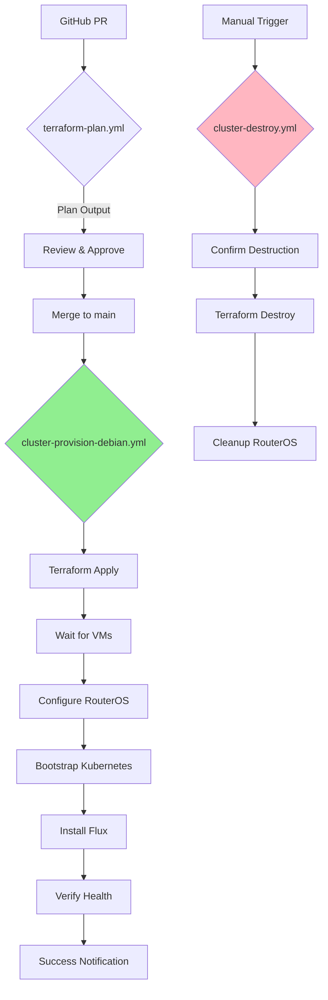

# GitHub Actions CI/CD Pipeline - Implementation Guide

## Overview

This document provides a complete implementation guide for the GitHub Actions-based cluster provisioning pipeline. It includes all workflow files, helper scripts, and Terraform modules needed to automate your Kubernetes cluster lifecycle.

## Architecture



## Directory Structure

```
home-ops/
├── .github/
│   ├── workflows/
│   │   ├── terraform-plan.yml              # NEW
│   │   ├── cluster-provision-debian.yml    # NEW
│   │   ├── cluster-provision-talos.yml     # NEW (optional)
│   │   ├── cluster-destroy.yml             # NEW
│   │   └── flux-validate.yml               # NEW
│   └── scripts/
│       ├── provision-cluster-debian.sh     # CREATED
│       ├── provision-cluster-talos.sh      # NEW
│       ├── wait-for-vms.sh                 # NEW
│       ├── configure-routeros.sh           # NEW
│       └── verify-cluster-health.sh        # NEW
├── terraform/
│   └── modules/
│       └── pve/
│           └── routeros-config/            # NEW MODULE
│               ├── main.tf
│               ├── variables.tf
│               ├── outputs.tf
│               └── bgp.tf
├── ansible/k8s/
│   └── playbooks/
│       ├── bootstrap-kubernetes.yml        # NEW
│       └── verify-cluster.yml              # NEW
└── docs/
    ├── CI_CD_PIPELINE.md                   # NEW
    └── CLUSTER_PROVISIONING.md             # NEW
```

## File Contents

### 1. `.github/workflows/terraform-plan.yml`

```yaml
name: Terraform Plan

on:
  pull_request:
    paths:
      - 'terraform/**'
      - '.github/workflows/terraform-plan.yml'

permissions:
  contents: read
  pull-requests: write

jobs:
  plan:
    name: Terraform Plan
    runs-on: self-hosted  # Requires runner with Proxmox access

    strategy:
      matrix:
        cluster:
          - 101  # Add more cluster IDs as needed

    env:
      SOPS_AGE_KEY: ${{ secrets.SOPS_AGE_KEY }}
      CLUSTER_ID: ${{ matrix.cluster }}

    steps:
      - name: Checkout
        uses: actions/checkout@v4

      - name: Setup SOPS Age Key
        run: |
          mkdir -p ~/.config/sops/age
          echo "$SOPS_AGE_KEY" > ~/.config/sops/age/age.agekey
          chmod 600 ~/.config/sops/age/age.agekey

      - name: Setup Terraform
        uses: hashicorp/setup-terraform@v3
        with:
          terraform_version: latest

      - name: Setup Terragrunt
        run: |
          TERRAGRUNT_VERSION=$(curl -s https://api.github.com/repos/gruntwork-io/terragrunt/releases/latest | jq -r '.tag_name' | sed 's/v//')
          wget -q https://github.com/gruntwork-io/terragrunt/releases/download/v${TERRAGRUNT_VERSION}/terragrunt_linux_amd64
          chmod +x terragrunt_linux_amd64
          sudo mv terragrunt_linux_amd64 /usr/local/bin/terragrunt

      - name: Terraform Plan - Cluster ${{ matrix.cluster }}
        id: plan
        working-directory: terraform/live/clusters/cluster-${{ env.CLUSTER_ID }}
        run: |
          terragrunt plan -no-color | tee plan.txt
          echo "plan_output<<EOF" >> $GITHUB_OUTPUT
          cat plan.txt >> $GITHUB_OUTPUT
          echo "EOF" >> $GITHUB_OUTPUT

      - name: Comment PR with Plan
        uses: actions/github-script@v7
        with:
          github-token: ${{ secrets.GITHUB_TOKEN }}
          script: |
            const output = `#### Terraform Plan - Cluster ${{ env.CLUSTER_ID }} \`${{ steps.plan.outcome }}\`

            <details><summary>Show Plan</summary>

            \`\`\`terraform
            ${{ steps.plan.outputs.plan_output }}
            \`\`\`

            </details>

            *Pusher: @${{ github.actor }}, Action: \`${{ github.event_name }}\`*`;

            github.rest.issues.createComment({
              issue_number: context.issue.number,
              owner: context.repo.owner,
              repo: context.repo.name,
              body: output
            })

      - name: Cleanup
        if: always()
        run: rm -f ~/.config/sops/age/age.agekey
```

### 2. `.github/workflows/cluster-provision-debian.yml`

```yaml
name: Provision Cluster (Debian)

on:
  workflow_dispatch:
    inputs:
      cluster_id:
        description: 'Cluster ID to provision'
        required: true
        type: choice
        options:
          - '101'
          - '102'
          - '103'
      action:
        description: 'Action to perform'
        required: true
        type: choice
        options:
          - 'apply'
          - 'plan'
        default: 'plan'
      skip_flux:
        description: 'Skip Flux CD installation'
        required: false
        type: boolean
        default: false
      skip_verify:
        description: 'Skip health verification'
        required: false
        type: boolean
        default: false

  push:
    branches:
      - main
    paths:
      - 'terraform/live/clusters/**'

permissions:
  contents: read
  issues: write

jobs:
  provision:
    name: Provision Cluster-${{ inputs.cluster_id || '101' }}
    runs-on: self-hosted
    timeout-minutes: 60

    env:
      CLUSTER_ID: ${{ inputs.cluster_id || '101' }}
      ACTION: ${{ inputs.action || 'plan' }}
      SKIP_FLUX: ${{ inputs.skip_flux && '--skip-flux' || '' }}
      SKIP_VERIFY: ${{ inputs.skip_verify && '--skip-verify' || '' }}
      SOPS_AGE_KEY: ${{ secrets.SOPS_AGE_KEY }}
      ANSIBLE_HOST_KEY_CHECKING: 'False'

    steps:
      - name: Checkout
        uses: actions/checkout@v4

      - name: Setup SOPS Age Key
        run: |
          mkdir -p ~/.config/sops/age
          echo "$SOPS_AGE_KEY" > ~/.config/sops/age/age.agekey
          chmod 600 ~/.config/sops/age/age.agekey

      - name: Setup Dependencies
        run: |
          # Terraform
          if ! command -v terraform &> /dev/null; then
            wget -qO- https://apt.releases.hashicorp.com/gpg | sudo gpg --dearmor -o /usr/share/keyrings/hashicorp-archive-keyring.gpg
            echo "deb [signed-by=/usr/share/keyrings/hashicorp-archive-keyring.gpg] https://apt.releases.hashicorp.com $(lsb_release -cs) main" | sudo tee /etc/apt/sources.list.d/hashicorp.list
            sudo apt update && sudo apt install -y terraform
          fi

          # Terragrunt
          if ! command -v terragrunt &> /dev/null; then
            TERRAGRUNT_VERSION=$(curl -s https://api.github.com/repos/gruntwork-io/terragrunt/releases/latest | jq -r '.tag_name' | sed 's/v//')
            wget -q https://github.com/gruntwork-io/terragrunt/releases/download/v${TERRAGRUNT_VERSION}/terragrunt_linux_amd64
            chmod +x terragrunt_linux_amd64
            sudo mv terragrunt_linux_amd64 /usr/local/bin/terragrunt
          fi

          # Ansible
          if ! command -v ansible &> /dev/null; then
            sudo apt update && sudo apt install -y ansible
          fi

          # kubectl
          if ! command -v kubectl &> /dev/null; then
            curl -LO "https://dl.k8s.io/release/$(curl -L -s https://dl.k8s.io/release/stable.txt)/bin/linux/amd64/kubectl"
            chmod +x kubectl
            sudo mv kubectl /usr/local/bin/
          fi

          # flux
          if ! command -v flux &> /dev/null; then
            curl -s https://fluxcd.io/install.sh | sudo bash
          fi

      - name: Provision Cluster
        id: provision
        run: |
          chmod +x .github/scripts/provision-cluster-debian.sh
          .github/scripts/provision-cluster-debian.sh \
            "$CLUSTER_ID" \
            "$ACTION" \
            $SKIP_FLUX \
            $SKIP_VERIFY

      - name: Get Cluster Info
        if: success() && env.ACTION == 'apply'
        run: |
          echo "## Cluster Information" >> $GITHUB_STEP_SUMMARY
          echo "" >> $GITHUB_STEP_SUMMARY
          echo "**Cluster ID:** cluster-$CLUSTER_ID" >> $GITHUB_STEP_SUMMARY
          echo "" >> $GITHUB_STEP_SUMMARY

          # Get node information
          echo "### Nodes" >> $GITHUB_STEP_SUMMARY
          kubectl get nodes -o wide >> $GITHUB_STEP_SUMMARY || echo "Unable to get nodes" >> $GITHUB_STEP_SUMMARY

          # Get Flux status if installed
          if [[ "$SKIP_FLUX" == "" ]]; then
            echo "" >> $GITHUB_STEP_SUMMARY
            echo "### Flux Status" >> $GITHUB_STEP_SUMMARY
            flux get all >> $GITHUB_STEP_SUMMARY || echo "Unable to get Flux status" >> $GITHUB_STEP_SUMMARY
          fi

      - name: Notify on Failure
        if: failure()
        uses: actions/github-script@v7
        with:
          github-token: ${{ secrets.GITHUB_TOKEN }}
          script: |
            github.rest.issues.create({
              owner: context.repo.owner,
              repo: context.repo.name,
              title: `Cluster ${{ env.CLUSTER_ID }} provisioning failed`,
              body: `Provisioning workflow failed for cluster-${{ env.CLUSTER_ID }}.

              **Action:** ${{ env.ACTION }}
              **Workflow Run:** https://github.com/${{ github.repository }}/actions/runs/${{ github.run_id }}

              Please check the logs for details.`,
              labels: ['infrastructure', 'automation', 'failure']
            })

      - name: Cleanup
        if: always()
        run: |
          rm -f ~/.config/sops/age/age.agekey
          # Clean up any sensitive terraform outputs
          find terraform/live/clusters/cluster-$CLUSTER_ID -name "*.tfstate*" -delete || true
```

### 3. `.github/scripts/wait-for-vms.sh`

```bash
#!/usr/bin/env bash
#
# Wait for VMs to be ready after Terraform provisioning
#
# This script waits for:
# 1. VMs to be running in Proxmox
# 2. SSH to be available
# 3. Cloud-init to complete
#

set -euo pipefail

CLUSTER_ID="${1:-101}"
MAX_WAIT=600  # 10 minutes
SLEEP_INTERVAL=10

# Colors
RED='\033[0;31m'
GREEN='\033[0;32m'
YELLOW='\033[1;33m'
BLUE='\033[0;34m'
NC='\033[0m'

log_info() { echo -e "${BLUE}[INFO]${NC} $1"; }
log_success() { echo -e "${GREEN}[SUCCESS]${NC} $1"; }
log_warn() { echo -e "${YELLOW}[WARN]${NC} $1"; }
log_error() { echo -e "${RED}[ERROR]${NC} $1"; }

# Get Terraform outputs to determine VM names/IPs
REPO_ROOT="$(cd "$(dirname "${BASH_SOURCE[0]}")/../.." && pwd)"
CLUSTER_DIR="${REPO_ROOT}/terraform/live/clusters/cluster-${CLUSTER_ID}"

if [[ ! -d "$CLUSTER_DIR" ]]; then
    log_error "Cluster directory not found: $CLUSTER_DIR"
    exit 1
fi

cd "$CLUSTER_DIR"

log_info "Getting VM information from Terraform..."
if ! terragrunt output -json > /tmp/tf_output.json 2>/dev/null; then
    log_error "Failed to get Terraform outputs"
    exit 1
fi

# Extract control plane IPs
CONTROL_PLANE_IPS=$(jq -r '.control_plane_ips.value[]' /tmp/tf_output.json 2>/dev/null || echo "")
WORKER_IPS=$(jq -r '.worker_ips.value[]' /tmp/tf_output.json 2>/dev/null || echo "")

ALL_IPS="${CONTROL_PLANE_IPS} ${WORKER_IPS}"

if [[ -z "$ALL_IPS" ]]; then
    log_error "No VM IPs found in Terraform output"
    exit 1
fi

log_info "Found VMs: $(echo $ALL_IPS | wc -w) total"

# Wait for SSH on all VMs
log_info "Waiting for SSH to be available..."
for ip in $ALL_IPS; do
    log_info "Checking SSH on $ip..."
    elapsed=0

    while (( elapsed < MAX_WAIT )); do
        if ssh -o ConnectTimeout=5 -o StrictHostKeyChecking=no -o UserKnownHostsFile=/dev/null root@"$ip" exit 2>/dev/null; then
            log_success "SSH available on $ip"
            break
        fi

        sleep $SLEEP_INTERVAL
        elapsed=$((elapsed + SLEEP_INTERVAL))

        if (( elapsed >= MAX_WAIT )); then
            log_error "Timeout waiting for SSH on $ip"
            exit 1
        fi
    done
done

# Wait for cloud-init to complete
log_info "Waiting for cloud-init to complete..."
for ip in $ALL_IPS; do
    log_info "Checking cloud-init on $ip..."
    elapsed=0

    while (( elapsed < MAX_WAIT )); do
        # Check if cloud-init final stage is done
        if ssh -o ConnectTimeout=5 -o StrictHostKeyChecking=no -o UserKnownHostsFile=/dev/null root@"$ip" \
            "cloud-init status --wait" 2>/dev/null; then
            log_success "Cloud-init complete on $ip"
            break
        fi

        sleep $SLEEP_INTERVAL
        elapsed=$((elapsed + SLEEP_INTERVAL))

        if (( elapsed >= MAX_WAIT )); then
            log_error "Timeout waiting for cloud-init on $ip"
            exit 1
        fi
    done
done

log_success "All VMs are ready!"
rm -f /tmp/tf_output.json
```

### 4. `.github/scripts/configure-routeros.sh`

```bash
#!/usr/bin/env bash
#
# Configure RouterOS for Kubernetes cluster
#
# This script configures:
# 1. BGP connection to cluster nodes
# 2. Static routes for loopback IPs
# 3. BGP peer groups and filters
#

set -euo pipefail

CLUSTER_ID="${1:-101}"

# Colors
RED='\033[0;31m'
GREEN='\033[0;32m'
YELLOW='\033[1;33m'
BLUE='\033[0;34m'
NC='\033[0m'

log_info() { echo -e "${BLUE}[INFO]${NC} $1"; }
log_success() { echo -e "${GREEN}[SUCCESS]${NC} $1"; }
log_warn() { echo -e "${YELLOW}[WARN]${NC} $1"; }
log_error() { echo -e "${RED}[ERROR]${NC} $1"; }

REPO_ROOT="$(cd "$(dirname "${BASH_SOURCE[0]}")/../.." && pwd)"
CLUSTER_DIR="${REPO_ROOT}/terraform/live/clusters/cluster-${CLUSTER_ID}"

log_info "Configuring RouterOS for cluster-${CLUSTER_ID}..."

# Apply RouterOS configuration via Terraform
cd "${REPO_ROOT}/terraform/modules/pve/routeros-config"

if [[ ! -f "main.tf" ]]; then
    log_warn "RouterOS Terraform module not found"
    log_warn "Skipping automated RouterOS configuration"
    log_warn "Manual configuration required - see: docs/ROS_BGP_CHANGES_NEEDED.md"
    exit 0
fi

# Use Terragrunt to apply RouterOS config
log_info "Applying RouterOS configuration via Terraform..."
terragrunt apply -auto-approve \
    -var="cluster_id=${CLUSTER_ID}"

log_success "RouterOS configuration complete"
```

### 5. `.github/scripts/verify-cluster-health.sh`

```bash
#!/usr/bin/env bash
#
# Verify Kubernetes cluster health
#
# Checks:
# 1. All nodes are Ready
# 2. BGP sessions are established
# 3. VIP is reachable
# 4. Core pods are running
# 5. Flux is synced (if installed)
#

set -euo pipefail

CLUSTER_ID="${1:-101}"

# Colors
RED='\033[0;31m'
GREEN='\033[0;32m'
YELLOW='\033[1;33m'
BLUE='\033[0;34m'
NC='\033[0m'

log_info() { echo -e "${BLUE}[INFO]${NC} $1"; }
log_success() { echo -e "${GREEN}[SUCCESS]${NC} $1"; }
log_warn() { echo -e "${YELLOW}[WARN]${NC} $1"; }
log_error() { echo -e "${RED}[ERROR]${NC} $1"; }

FAILED_CHECKS=0

check() {
    local name="$1"
    local command="$2"

    log_info "Checking: $name..."
    if eval "$command"; then
        log_success "$name: PASS"
    else
        log_error "$name: FAIL"
        ((FAILED_CHECKS++))
    fi
}

log_info "========================================="
log_info "  Cluster Health Verification"
log_info "  Cluster: cluster-${CLUSTER_ID}"
log_info "========================================="

# Check 1: Nodes Ready
check "All nodes Ready" \
    "kubectl get nodes --no-headers | grep -v NotReady | wc -l | grep -q 6"

# Check 2: System pods
check "kube-system pods running" \
    "kubectl get pods -n kube-system --field-selector=status.phase!=Running | grep -v NAME | wc -l | grep -q '^0$'"

# Check 3: Cilium agent
check "Cilium agents running" \
    "kubectl get pods -n kube-system -l k8s-app=cilium --field-selector=status.phase=Running | grep -v NAME | wc -l | grep -q 6"

# Check 4: CoreDNS
check "CoreDNS pods running" \
    "kubectl get pods -n kube-system -l k8s-app=kube-dns --field-selector=status.phase=Running | grep -v NAME | wc -l | grep -q '[2-9]'"

# Check 5: Flux (if installed)
if kubectl get namespace flux-system &>/dev/null; then
    check "Flux namespace exists" "true"
    check "Flux pods running" \
        "kubectl get pods -n flux-system --field-selector=status.phase!=Running | grep -v NAME | wc -l | grep -q '^0$'"
    check "Flux reconciliation" \
        "flux get all | grep -v 'Unknown' | grep -v 'False'"
else
    log_info "Flux not installed, skipping Flux checks"
fi

# Summary
log_info ""
log_info "========================================="
if (( FAILED_CHECKS == 0 )); then
    log_success "All health checks passed!"
    log_info "========================================="
    exit 0
else
    log_error "$FAILED_CHECKS health check(s) failed"
    log_info "========================================="
    exit 1
fi
```

## Ansible Playbooks

### 6. `ansible/k8s/playbooks/bootstrap-kubernetes.yml`

```yaml
---
# Bootstrap Kubernetes cluster using kubeadm
#
# This playbook:
# 1. Labels nodes with topology information
# 2. Initializes the first control plane node
# 3. Joins remaining control plane nodes
# 4. Joins worker nodes
# 5. Configures kubelet settings
#
# Usage:
#   ansible-playbook -i inventory/hosts.ini playbooks/bootstrap-kubernetes.yml

- name: Label nodes with topology information
  hosts: all
  become: yes
  tasks:
    - name: Get node topology
      set_fact:
        pve_host: "{{ ansible_host.split('::')[0].split('.')[-1] }}"

    - name: Label node with topology
      shell: |
        kubectl label node {{ inventory_hostname }} \
          topology.kubernetes.io/zone={{ pve_host }} \
          --overwrite
      delegate_to: "{{ groups['controlplane'][0] }}"
      when: inventory_hostname in groups['controlplane'] or inventory_hostname in groups['workers']

- name: Initialize first control plane
  hosts: controlplane[0]
  become: yes
  tasks:
    - name: Check if cluster is already initialized
      stat:
        path: /etc/kubernetes/admin.conf
      register: kubeconfig

    - name: Initialize Kubernetes cluster
      shell: |
        kubeadm init \
          --config /etc/kubernetes/kubeadm-config.yaml \
          --upload-certs
      when: not kubeconfig.stat.exists
      register: kubeadm_init

    - name: Save join commands
      copy:
        content: "{{ kubeadm_init.stdout }}"
        dest: /tmp/kubeadm-join-commands.txt
      when: kubeadm_init.changed

- name: Join additional control planes
  hosts: controlplane[1:]
  become: yes
  serial: 1
  tasks:
    - name: Check if already joined
      stat:
        path: /etc/kubernetes/kubelet.conf
      register: kubelet_conf

    - name: Join control plane
      shell: "{{ hostvars[groups['controlplane'][0]]['kubeadm_init'].stdout_lines | select('search', 'kubeadm join.*control-plane') | first }}"
      when: not kubelet_conf.stat.exists

- name: Join worker nodes
  hosts: workers
  become: yes
  serial: 1
  tasks:
    - name: Check if already joined
      stat:
        path: /etc/kubernetes/kubelet.conf
      register: kubelet_conf

    - name: Join as worker
      shell: "{{ hostvars[groups['controlplane'][0]]['kubeadm_init'].stdout_lines | select('search', 'kubeadm join') | reject('search', 'control-plane') | first }}"
      when: not kubelet_conf.stat.exists
```

### 7. `ansible/k8s/playbooks/verify-cluster.yml`

```yaml
---
# Verify Kubernetes cluster health
#
# This playbook checks:
# - Node status
# - BGP sessions
# - FRR configuration
# - VIP reachability
# - System pod health

- name: Verify cluster health
  hosts: all
  become: yes
  gather_facts: yes

  tasks:
    - name: Check kubelet status
      systemd:
        name: kubelet
        state: started
      register: kubelet_status

    - name: Check FRR status
      systemd:
        name: frr
        state: started
      register: frr_status

    - name: Get BGP summary
      shell: vtysh -c 'show bgp summary'
      register: bgp_summary
      changed_when: false

    - name: Verify BGP sessions established
      assert:
        that:
          - "'Established' in bgp_summary.stdout"
        fail_msg: "BGP sessions not established"
        success_msg: "BGP sessions OK"

    - name: Check VIP reachability (control plane only)
      shell: ping6 -c 1 fd00:255:101::ac
      register: vip_ping
      when: inventory_hostname in groups['controlplane']
      changed_when: false
      failed_when: false

    - name: Display VIP status
      debug:
        msg: "VIP reachable: {{ vip_ping.rc == 0 }}"
      when: inventory_hostname in groups['controlplane']

- name: Verify Kubernetes resources
  hosts: controlplane[0]
  gather_facts: no

  tasks:
    - name: Get node status
      shell: kubectl get nodes -o wide
      register: nodes
      changed_when: false

    - name: Display nodes
      debug:
        var: nodes.stdout_lines

    - name: Check all nodes Ready
      shell: kubectl get nodes --no-headers | grep -v Ready | wc -l
      register: not_ready
      failed_when: not_ready.stdout != "0"
      changed_when: false

    - name: Get system pods
      shell: kubectl get pods -n kube-system
      register: system_pods
      changed_when: false

    - name: Display system pods
      debug:
        var: system_pods.stdout_lines
```

## Next Steps

1. **Create all helper scripts** (wait-for-vms.sh, configure-routeros.sh, verify-cluster-health.sh)
2. **Create all GitHub Actions workflows**
3. **Create Ansible playbooks**
4. **Create RouterOS Terraform module**
5. **Test on cluster-101 in dry-run mode**
6. **Full test on new cluster-102**

## Usage Examples

### Provision a new cluster via GitHub Actions

1. Go to Actions tab in GitHub
2. Select "Provision Cluster (Debian)"
3. Click "Run workflow"
4. Select cluster ID (101, 102, etc.)
5. Choose action (plan or apply)
6. Configure options (skip Flux, skip verify)
7. Click "Run workflow"

### Provision locally

```bash
# Plan changes
./.github/scripts/provision-cluster-debian.sh 101 plan

# Apply changes
./.github/scripts/provision-cluster-debian.sh 101 apply

# Skip Flux installation
./.github/scripts/provision-cluster-debian.sh 101 apply --skip-flux

# Dry run
./.github/scripts/provision-cluster-debian.sh 101 apply --dry-run
```

### Destroy a cluster

```bash
./.github/scripts/provision-cluster-debian.sh 101 destroy
```

## Self-Hosted Runner Setup

To use these workflows, you need a self-hosted GitHub Actions runner with:

1. **Network access** to Proxmox API
2. **Installed tools**:
   - terraform
   - terragrunt
   - ansible
   - kubectl
   - flux
   - jq
   - ssh client
3. **GitHub Secrets**:
   - `SOPS_AGE_KEY` - Your SOPS Age private key

### Install runner

```bash
# On your Proxmox host or management VM
mkdir actions-runner && cd actions-runner
curl -o actions-runner-linux-x64-2.311.0.tar.gz -L \
  https://github.com/actions/runner/releases/download/v2.311.0/actions-runner-linux-x64-2.311.0.tar.gz
tar xzf ./actions-runner-linux-x64-2.311.0.tar.gz

# Configure (get token from GitHub Settings > Actions > Runners)
./config.sh --url https://github.com/YOUR_USERNAME/home-ops --token YOUR_TOKEN

# Install as service
sudo ./svc.sh install
sudo ./svc.sh start
```

## Security Considerations

1. **Secrets Management**:
   - All secrets stored in GitHub Secrets
   - SOPS Age key only in memory during workflow
   - Cleanup steps remove sensitive files

2. **Network Security**:
   - Self-hosted runner must have Proxmox access
   - Consider firewall rules limiting runner access
   - Use SSH keys for Ansible (not passwords)

3. **State Management**:
   - Terraform state in local backend (or migrate to S3)
   - State files cleaned up after workflow
   - Consider remote state for production

## Troubleshooting

### Workflow fails at Terraform step

Check:
- SOPS Age key is correct in GitHub Secrets
- Runner has network access to Proxmox
- Terraform/Terragrunt versions compatible

### VMs don't become ready

Check:
- Cloud-init logs: `ssh root@VM_IP journalctl -u cloud-init`
- Proxmox console for boot errors
- Network connectivity from runner to VMs

### BGP sessions not established

Check:
- FRR logs: `ssh root@VM_IP journalctl -u frr`
- RouterOS BGP config: `ROS> /routing/bgp/connection print`
- Firewall rules on both sides

### Flux bootstrap fails

Check:
- GitHub token has correct permissions
- Repository path exists: `kubernetes/clusters/production`
- SOPS Age key is in `/root/.config/sops/age/age.agekey`

## Future Enhancements

1. **Talos Support** - Add parallel workflow for Talos-based clusters
2. **Multi-Cluster** - Support provisioning multiple clusters simultaneously
3. **Blue/Green** - Implement blue/green cluster deployments
4. **Monitoring** - Add Prometheus metrics for provisioning time
5. **Slack/Discord** - Notification integrations
6. **Cost Tracking** - Track resource usage per cluster
7. **Automated Testing** - Smoke tests after provisioning
8. **Rollback** - Automated rollback on failures

## References

- [Terraform Proxmox Provider](https://registry.terraform.io/providers/bpg/proxmox/latest/docs)
- [Terragrunt Documentation](https://terragrunt.gruntwork.io/)
- [Flux CD Bootstrap](https://fluxcd.io/flux/installation/)
- [GitHub Actions Self-Hosted Runners](https://docs.github.com/en/actions/hosting-your-own-runners)
- [SOPS with Age](https://github.com/getsops/sops#encrypting-using-age)
