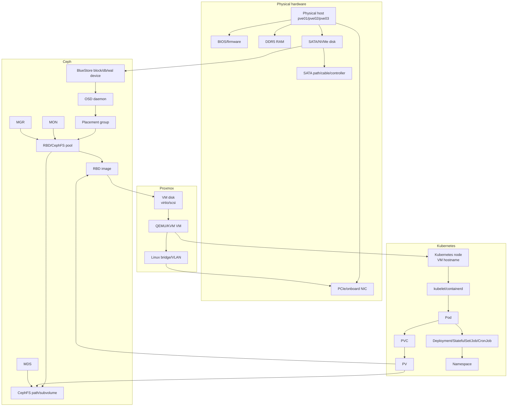

# Forward-Looking Observability Model for Proxmox, Ceph, Kubernetes, and Hardware

Date: 2026-06-28

Audience: SREs operating a homelab or small production cluster with Proxmox hosts, Kubernetes nodes in VMs, Ceph RBD/CephFS storage, and physical disks/NICs.

Related operational docs:

- [Runbook index](runbooks/README.md)
- [Incident report template](runbooks/incident-report-template.md)

## 0. Operating Principles

This model is designed to answer cross-layer questions quickly:

- Which workload is causing IO?
- Which VM and Proxmox host are involved?
- Which RBD image, Ceph pool, PGs, OSDs, and disks are serving that IO?
- Is Ceph recovery, backfill, scrub, deep-scrub, network loss, disk latency, or hardware/firmware behavior competing with client IO?
- What should be paused, throttled, migrated, or repaired first?

The system should prefer automated correlation over shell spelunking. Manual commands are still useful during incidents, but they should confirm what dashboards and alerts already show.

Core principles:

- Every metric must carry stable identity labels.
- Every dynamic mapping must be exported as a metric or inventory table.
- Every alert must identify the affected layer, probable next hop, and runbook.
- Dashboards must support drill-down from "cluster unhealthy" to "pod -> PVC -> RBD image -> pool/PG -> OSD -> physical disk/NIC/host".
- Logs and events must be linked by the same labels used in metrics.

## 1. Layered Dependency Model

### 1.1 Dependency Graph



### 1.2 Identity Objects

| Object | Required stable identity | Notes |
|---|---|---|
| Physical host | `host_id`, `instance`, `pve_node`, `serial` | `pve_node` must match Proxmox node name. |
| Physical disk | `host_id`, `disk`, `by_id`, `serial`, `model`, `wwn`, `bus`, `slot` | Prefer `/dev/disk/by-id` or WWN over `/dev/sdX`. |
| NIC | `host_id`, `interface`, `pci_slot`, `driver`, `firmware`, `mac`, `vlan` | Track PCIe location for repeated hardware issues. |
| OSD | `ceph_cluster`, `osd_id`, `host_id`, `device_serial`, `device_by_id`, `class` | Must map OSD to physical device. |
| Pool | `ceph_cluster`, `pool_id`, `pool_name`, `pool_type` | `pool_type`: `rbd`, `cephfs_metadata`, `cephfs_data`, `other`. |
| PG | `ceph_cluster`, `pool_id`, `pool_name`, `pgid`, `acting_set` | Acting set is dynamic; export current mapping. |
| RBD image | `ceph_cluster`, `pool_name`, `namespace`, `image`, `image_id` | `image_id` is safer than mutable image name. |
| CephFS path/subvolume | `ceph_cluster`, `fs_name`, `subvolume_group`, `subvolume`, `path` | Path cardinality must be controlled. |
| Proxmox VM | `pve_node`, `vmid`, `vm_name`, `vm_uuid` | `vmid` is primary inside Proxmox. |
| VM disk | `pve_node`, `vmid`, `disk`, `backend`, `pool_name`, `image` | Example disk: `scsi0`, `virtio0`. |
| Kubernetes node | `cluster`, `node`, `vmid`, `pve_node` | Node name should be joined to VM identity. |
| PVC/PV | `cluster`, `namespace`, `persistentvolumeclaim`, `persistentvolume`, `storageclass` | Include CSI volume handle. |
| Pod/workload | `cluster`, `namespace`, `pod`, `uid`, `workload`, `workload_kind` | Use owner resolution to avoid ReplicaSet noise. |

## 2. Metrics Inventory

### 2.1 Physical Hardware

| Metric family | Source/exporter/tool | Frequency | Required labels | Why it matters |
|---|---|---:|---|---|
| CPU pressure, load, steal, throttling | `node_exporter` | 15s | `instance`, `host_id`, `pve_node` | Separates storage slowness from host saturation. |
| Memory available, swap, PSI | `node_exporter` | 15s | `instance`, `host_id`, `pve_node` | VM stalls and OSD stalls often follow memory pressure. |
| Disk IO time, queue, read/write latency proxy | `node_exporter` diskstats | 15s | `instance`, `host_id`, `device`, `by_id`, `serial` | Detects saturated or failing devices. |
| Filesystem fullness/inodes | `node_exporter` | 30s | `mountpoint`, `fstype`, `host_id` | Full OSD metadata/device partitions can cascade. |
| SMART attributes | `smartctl_exporter` | 5m | `host_id`, `device`, `serial`, `model`, `wwn` | Predictive disk failure, reallocated sectors, media errors. |
| NVMe health | `smartctl_exporter` or `nvme_exporter` | 1m-5m | `host_id`, `serial`, `model`, `namespace` | Critical warnings, temperature, media errors, percentage used. |
| SATA link resets and ATA errors | host logs -> Fluent Bit -> Victoria Logs, optional custom exporter | 30s logs, 1m metric | `host_id`, `device`, `controller`, `ata_port` | Explains repeated slow OSDs without SMART failure. |
| NIC throughput/errors/drops | `node_exporter` netdev/ethtool | 15s | `host_id`, `interface`, `driver`, `firmware`, `pci_slot` | Differentiates disk latency from network loss. |
| NIC link speed/duplex | `node_exporter` ethtool collector or custom exporter | 1m | `host_id`, `interface`, `speed`, `duplex` | Bad cables/autoneg can mimic Ceph slowness. |
| PCIe AER/MCE/EDAC errors | `rasdaemon`, `node_exporter` textfile, Victoria Logs | 1m | `host_id`, `pci_slot`, `component` | Detects BIOS/PCIe/platform instability. |
| BIOS/firmware inventory | custom textfile exporter | 1h | `host_id`, `bios_version`, `board`, `vendor` | Enables repeated behavior correlation by board/firmware. |

Example textfile inventory metric:

```text
homelab_host_firmware_info{host_id="pve01",pve_node="pve01",board="MiniITX-X",bios_version="1.23",bmc_version="none"} 1
homelab_nic_info{host_id="pve01",interface="enp3s0",pci_slot="0000:03:00.0",driver="igc",firmware="1.2.3",mac="aa:bb:cc:dd:ee:ff"} 1
homelab_disk_info{host_id="pve01",disk="/dev/disk/by-id/ata-XYZ",serial="XYZ",model="SSD-4T",bus="sata",slot="bay1"} 1
```

### 2.2 Proxmox

| Metric family | Source/exporter/tool | Frequency | Required labels | Why it matters |
|---|---|---:|---|---|
| Host CPU/memory/load | Proxmox API exporter, node_exporter | 15s | `pve_node`, `host_id` | Confirms host resource exhaustion. |
| VM CPU, memory, ballooning | Proxmox API exporter | 15s | `pve_node`, `vmid`, `vm_name` | Shows noisy VM and pressure on VM. |
| VM disk read/write bytes/ops | Proxmox API/RRD exporter, QEMU guest agent if available | 15s | `pve_node`, `vmid`, `vm_name`, `disk` | Connects VM IO to Ceph backend. |
| VM network bytes/drops | Proxmox API exporter | 15s | `pve_node`, `vmid`, `netif`, `bridge`, `vlan` | Detects storage clients also saturating network. |
| VM placement | custom Proxmox inventory exporter | 30s-60s | `pve_node`, `vmid`, `vm_name`, `status` | Required join from Kubernetes node to Proxmox host. |
| VM disk backend mapping | custom Proxmox inventory exporter | 60s | `vmid`, `disk`, `backend`, `pool_name`, `image`, `rbd_image_id` | Required join from VM disk to RBD image. |
| Bridge/VLAN stats | node_exporter netdev, bridge exporter or textfile | 15s | `pve_node`, `bridge`, `interface`, `vlan` | Finds L2 bottlenecks and packet drops. |
| QEMU block latency, if available | QMP collector/custom exporter | 15s | `vmid`, `disk` | Distinguishes guest-generated IO from backend latency. |

Custom mapping metric:

```text
homelab_proxmox_vm_info{pve_node="pve01",vmid="101",vm_name="k8s-cp-01",vm_uuid="...",k8s_node="k8s-cp-01"} 1
homelab_proxmox_vm_disk_info{pve_node="pve01",vmid="101",vm_name="k8s-cp-01",disk="scsi0",backend="rbd",pool_name="vmpool",image="vm-101-disk-0",rbd_image_id="abc123"} 1
```

### 2.3 Ceph

| Metric family | Source/exporter/tool | Frequency | Required labels | Why it matters |
|---|---|---:|---|---|
| Cluster health status | Ceph manager Prometheus module | 15s | `ceph_cluster` | First safety signal. |
| PG states: active, clean, degraded, undersized, remapped, peering, stale | Ceph mgr Prometheus | 15s | `ceph_cluster`, `pool_name`, `pg_state` | Data safety and availability. |
| OSD up/in state | Ceph mgr Prometheus | 15s | `ceph_cluster`, `osd_id`, `host_id` | Immediate failure domain signal. |
| OSD client read/write bytes/ops | Ceph mgr Prometheus | 15s | `osd_id`, `host_id`, `device_class` | Identifies hot OSDs and client pressure. |
| OSD apply/commit latency | Ceph mgr Prometheus | 15s | `osd_id`, `host_id` | Slow ops and disk/backend latency. |
| BlueStore slow ops / deferred writes / compaction | Ceph mgr Prometheus, logs -> Victoria Logs | 15s metrics, logs realtime | `osd_id`, `host_id`, `device_serial` | Indicates OSD internal latency. |
| Recovery/backfill bytes/objects | Ceph mgr Prometheus | 15s | `pool_name`, `osd_id` if available | Shows competition with client IO. |
| Scrub/deep-scrub activity | Ceph mgr Prometheus, logs | 30s | `pool_name`, `pgid`, `osd_id` | Scrub can compete with client IO. |
| Pool client IO | Ceph mgr Prometheus | 15s | `pool_id`, `pool_name` | Top-level client demand. |
| RBD image IO | Ceph mgr Prometheus RBD stats, enabled per pool | 15s-30s | `pool_name`, `namespace`, `image`, `image_id` | Required for VM/PVC attribution. |
| MDS health, request latency, cache, sessions | Ceph mgr Prometheus | 15s | `fs_name`, `mds`, `rank`, `host_id` | CephFS availability and metadata bottlenecks. |
| MON quorum and election | Ceph mgr Prometheus | 15s | `mon`, `host_id` | Control-plane stability. |
| Device health | Ceph devicehealth module, smartctl_exporter | 1m-5m | `osd_id`, `serial`, `host_id` | Links Ceph risk to physical disk. |
| PG to OSD mapping | custom exporter from `ceph pg dump`/mgr API | 60s | `pool_name`, `pgid`, `osd_id`, `role` | Required to answer "which disks serve this IO?" |

RBD image stats must be enabled for relevant pools. Keep labels bounded: do not expose per-object metrics.

Custom PG mapping metric:

```text
homelab_ceph_pg_acting_osd_info{ceph_cluster="ceph",pool_name="vmpool",pgid="12.34",osd_id="3",role="primary"} 1
homelab_ceph_osd_device_info{ceph_cluster="ceph",osd_id="3",host_id="pve02",device_by_id="/dev/disk/by-id/ata-XYZ",serial="XYZ",class="ssd"} 1
```

### 2.4 Kubernetes

| Metric family | Source/exporter/tool | Frequency | Required labels | Why it matters |
|---|---|---:|---|---|
| Node CPU/memory/filesystem/network | kubelet/cAdvisor, node_exporter in VM | 15s | `cluster`, `node`, `vmid`, `pve_node` | Shows node pressure and links to VM. |
| Pod/container CPU/memory | kubelet/cAdvisor | 15s | `cluster`, `namespace`, `pod`, `container`, `node` | Workload saturation and noisy neighbor analysis. |
| Pod/container filesystem reads/writes | kubelet/cAdvisor | 15s | `namespace`, `pod`, `container`, `device`, `node` | First attribution for IO-heavy pods. |
| Container blkio / IO service bytes | cAdvisor, runtime metrics where available | 15s | `pod`, `container`, `device`, `node` | Best pod-level disk attribution. |
| PVC/PV/storageclass mapping | kube-state-metrics | 30s | `namespace`, `persistentvolumeclaim`, `persistentvolume`, `storageclass`, `volumename` | Connects pods to CSI volumes. |
| Pod volume mounts | kube-state-metrics plus custom pod-volume exporter | 30s | `namespace`, `pod`, `persistentvolumeclaim`, `volume` | Connects pod to PVC. |
| PV CSI volume handle | kube-state-metrics if exposed, otherwise custom exporter | 30s | `persistentvolume`, `driver`, `volume_handle`, `pool_name`, `image` | Connects PVC to RBD/CephFS. |
| Workload ownership | kube-state-metrics | 30s | `namespace`, `pod`, `workload`, `workload_kind` | Aggregates noisy pods into service owners. |
| Node pressure conditions | kube-state-metrics | 15s-30s | `node`, `condition` | Memory, disk, PID, network pressure. |
| Kubelet/containerd errors | Fluent Bit -> Victoria Logs | realtime | `cluster`, `node`, `unit`, `pod` where available | Explains mount, CSI, and runtime failures. |
| CSI sidecar metrics | ceph-csi provisioner/nodeplugin metrics | 15s | `driver`, `node`, `operation`, `volume_id` | Provisioning, attach, mount latency and errors. |

Custom pod-volume mapping:

```text
homelab_kube_pod_pvc_info{cluster="prod",namespace="db",pod="postgres-0",node="k8s-worker-02",persistentvolumeclaim="pgdata-postgres-0",workload="postgres",workload_kind="StatefulSet"} 1
homelab_kube_pv_ceph_info{cluster="prod",persistentvolume="pvc-...",driver="rbd.csi.ceph.com",pool_name="k8s-rbd",image="csi-vol-...",image_id="def456"} 1
homelab_kube_node_vm_info{cluster="prod",node="k8s-worker-02",vmid="202",vm_name="k8s-worker-02",pve_node="pve03"} 1
```

### 2.5 Application Layer

| Metric family | Source/exporter/tool | Frequency | Required labels | Why it matters |
|---|---|---:|---|---|
| Database IOPS, latency, WAL/fsync time | DB exporters: postgres_exporter, mysqld_exporter, etc. | 15s | `namespace`, `pod`, `workload`, `database` | Maps app demand to storage pressure. |
| Backup job throughput and concurrency | app metrics or custom exporter | 15s-30s | `namespace`, `job`, `target`, `pvc` | Backups frequently collide with recovery. |
| Object storage ops/latency | MinIO/Ceph RGW exporter if used | 15s | `namespace`, `tenant`, `bucket` | Identifies high-read/high-write services. |
| HTTP/gRPC request latency/errors | app metrics, OpenTelemetry | 15s | `service`, `namespace`, `workload` | Quantifies user impact. |
| Application logs | Fluent Bit -> Victoria Logs | realtime | `namespace`, `pod`, `container`, `workload` | Correlates errors with infrastructure events. |

## 3. Correlation Model

### 3.1 Required Joins

Goal path:

```text
namespace/pod/container
  -> node
  -> vmid/vm_name
  -> pve_node
  -> VM disk
  -> RBD image or CephFS subvolume
  -> pool
  -> PGs
  -> acting OSDs
  -> host/device/NIC
```

Required mapping metrics:

```text
homelab_kube_pod_pvc_info{cluster,namespace,pod,node,persistentvolumeclaim,workload,workload_kind}
homelab_kube_pvc_pv_info{cluster,namespace,persistentvolumeclaim,persistentvolume,storageclass}
homelab_kube_pv_ceph_info{cluster,persistentvolume,driver,pool_name,image,image_id,fs_name,subvolume}
homelab_kube_node_vm_info{cluster,node,vmid,vm_name,pve_node}
homelab_proxmox_vm_info{pve_node,vmid,vm_name,k8s_node}
homelab_proxmox_vm_disk_info{pve_node,vmid,disk,backend,pool_name,image,image_id}
homelab_ceph_rbd_image_info{ceph_cluster,pool_name,namespace,image,image_id,owner_type,owner_id}
homelab_ceph_pg_acting_osd_info{ceph_cluster,pool_name,pgid,osd_id,role}
homelab_ceph_osd_device_info{ceph_cluster,osd_id,host_id,device_by_id,serial,class}
homelab_disk_info{host_id,device_by_id,serial,model,bus,slot}
homelab_nic_info{host_id,interface,pci_slot,driver,firmware}
```

Use `*_info` metrics with value `1`. They act as join tables in PromQL and as dimensions in Grafana.

### 3.2 Label Schema

Recommended global labels:

```yaml
external_labels:
  site: homelab
  env: prod
  prometheus: prom-main
```

Recommended resource labels:

```yaml
labels:
  ceph_cluster: ceph
  k8s_cluster: prod
  pve_cluster: pve
  pve_node: pve01
  host_id: pve01
  vmid: "202"
  vm_name: k8s-worker-02
  node: k8s-worker-02
  namespace: db
  workload: postgres
  workload_kind: StatefulSet
  persistentvolumeclaim: pgdata-postgres-0
  persistentvolume: pvc-abc
  pool_name: k8s-rbd
  image: csi-vol-abc
  image_id: def456
  osd_id: "3"
  device_by_id: /dev/disk/by-id/ata-XYZ
  serial: XYZ
```

Avoid:

- Mutable `/dev/sdX` as the only disk label.
- Pod UID as the only pod identity.
- Per-file CephFS labels.
- Per-object RADOS labels.
- High-cardinality application IDs unless needed for incident response.

### 3.3 Example PromQL Joins

Pod write throughput:

```promql
sum by (cluster, namespace, pod, node) (
  rate(container_fs_writes_bytes_total{container!="",pod!=""}[5m])
)
```

Pod write throughput with PVC ownership:

```promql
sum by (cluster, namespace, pod, persistentvolumeclaim, workload, workload_kind) (
  rate(container_fs_writes_bytes_total{container!="",pod!=""}[5m])
  * on (cluster, namespace, pod) group_left(persistentvolumeclaim, workload, workload_kind)
    homelab_kube_pod_pvc_info
)
```

PVC to Ceph RBD image:

```promql
homelab_kube_pod_pvc_info
* on (cluster, namespace, persistentvolumeclaim) group_left(persistentvolume, storageclass)
  homelab_kube_pvc_pv_info
* on (cluster, persistentvolume) group_left(driver, pool_name, image, image_id)
  homelab_kube_pv_ceph_info
```

Kubernetes node to VM and Proxmox host:

```promql
homelab_kube_node_vm_info
* on (vmid) group_left(pve_node, vm_name)
  homelab_proxmox_vm_info
```

Top RBD images by write throughput:

```promql
topk(10,
  sum by (pool_name, image, image_id) (
    rate(ceph_rbd_write_bytes_total[5m])
  )
)
```

VM disk IO joined to RBD image:

```promql
sum by (pve_node, vmid, vm_name, disk, pool_name, image, image_id) (
  rate(proxmox_vm_disk_write_bytes_total[5m])
  * on (pve_node, vmid, disk) group_left(pool_name, image, image_id)
    homelab_proxmox_vm_disk_info
)
```

RBD image to OSDs is approximate unless object-to-PG mapping is sampled. Use pool PG mapping for "involved OSDs":

```promql
sum by (pool_name, osd_id, host_id, device_by_id, serial) (
  homelab_ceph_pg_acting_osd_info
  * on (osd_id) group_left(host_id, device_by_id, serial)
    homelab_ceph_osd_device_info
)
```

Client IO versus recovery IO:

```promql
sum(rate(ceph_pool_wr_bytes[5m])) by (pool_name)
/
clamp_min(sum(rate(ceph_osd_recovery_bytes[5m])), 1)
```

OSD latency outliers:

```promql
topk(10,
  ceph_osd_apply_latency_ms
)
```

Physical disk IO latency proxy:

```promql
rate(node_disk_io_time_seconds_total[5m])
/
clamp_min(rate(node_disk_reads_completed_total[5m]) + rate(node_disk_writes_completed_total[5m]), 1)
```

NIC errors/drops:

```promql
sum by (host_id, device) (
  rate(node_network_receive_errs_total[5m])
  + rate(node_network_transmit_errs_total[5m])
  + rate(node_network_receive_drop_total[5m])
  + rate(node_network_transmit_drop_total[5m])
)
```

## 4. Dashboards

### 4.1 Executive Cluster Health

Purpose: answer "Are we safe, degraded, slow, or user-impacting?"

Panels:

- Overall health: Ceph health, Kubernetes node readiness, Proxmox host up, alert count.
- Data safety: degraded/undersized/remapped/stale PGs.
- Availability: OSDs down/out, MON quorum, MDS active ranks.
- User impact: app error rate/latency, PVC mount failures, pod restarts.
- Capacity: Ceph raw/usable, pool fullness, host disk fullness.
- Current contention: client IO, recovery/backfill IO, scrub/deep-scrub active.
- Hot resources: top pods by IO, top VMs by IO, top RBD images by IO, top OSD latencies.
- Recent events: OSD down/up, MDS crash, kernel ATA/NVMe/NIC errors, node pressure.

Variables:

- `$site`, `$ceph_cluster`, `$k8s_cluster`, `$pve_cluster`, `$pve_node`, `$namespace`.

### 4.2 Ceph Recovery and Data Safety

Purpose: answer "Is recovery making progress and is data safe?"

Panels:

- PG state counts over time.
- Recovery/backfill bytes/s and objects/s.
- Degraded and misplaced objects.
- OSD up/in map.
- Recovery target/source OSDs.
- Recovery throttles/config values.
- Scrub/deep-scrub active PGs.
- Pool fullness and nearfull/backfillfull flags.
- OSD apply/commit latency heatmap.
- OSD logs from Victoria Logs filtered by `slow request`, `backfill`, `recovery`, `scrub`, `bluestore`.

### 4.3 Ceph Client IO by Pool/Image

Purpose: answer "Who is using Ceph right now?"

Panels:

- Pool read/write bytes/s and ops/s.
- RBD image read/write bytes/s and ops/s.
- RBD image latency if available.
- Image-to-owner table: image, pool, owner type, VM/PVC, namespace/workload.
- Client IO versus recovery IO.
- Top images during recovery.
- Image history: last 24h top talkers.

### 4.4 Proxmox VM IO by VM/Disk/Host

Purpose: answer "Which VM is generating IO and where is it running?"

Panels:

- VM disk read/write bytes/s and ops/s by `vmid`, `disk`.
- VM disk latency if QMP/guest agent available.
- VM CPU, memory, balloon, swap.
- VM network throughput.
- VM placement table: `vmid`, `vm_name`, `pve_node`, Kubernetes node, VM disks, RBD images.
- Host resource pressure: CPU, memory, disk, NIC.
- Migration candidates: noisy VM on degraded Ceph host.

### 4.5 Kubernetes Workload IO by Namespace/Pod/PVC

Purpose: answer "Which pod/PVC/workload is causing IO?"

Panels:

- Top namespaces by disk read/write bytes/s.
- Top workloads by disk read/write bytes/s.
- Top pods/containers by filesystem IO.
- PVC mapping table: namespace, pod, workload, PVC, PV, storageclass, RBD image/CephFS path.
- Node placement: pod -> node -> vmid -> Proxmox host.
- Node pressure and eviction signals.
- CSI operation latency/errors.
- Pod restarts and application error rate.

### 4.6 Physical Disk/SATA/NVMe/NIC Health

Purpose: answer "Is hardware causing or amplifying the issue?"

Panels:

- Disk SMART critical attributes by host/slot.
- NVMe media errors, critical warning, temperature, percentage used.
- Disk IO utilization and latency proxy.
- Kernel logs: ATA resets, I/O errors, NVMe timeouts.
- NIC throughput/errors/drops/retransmits.
- Link speed/duplex changes.
- PCIe AER, MCE, EDAC events.
- Firmware inventory table by host.
- Repeated offender table: same disk slot, same NIC PCIe slot, same BIOS version, same host.

### 4.7 Incident Drill-Down Dashboard

Purpose: one dashboard for active incident response.

Variables:

- `$namespace`, `$pod`, `$pvc`, `$node`, `$vmid`, `$pve_node`, `$pool_name`, `$image`, `$osd_id`, `$host_id`.

Flow:

1. Start with active alerts and timeline annotations.
2. Select affected pod/PVC/workload.
3. Show node/VM/host placement.
4. Show RBD/CephFS mapping.
5. Show pool/PG/OSD mapping.
6. Show OSD/disk/NIC health.
7. Show client IO versus recovery/scrub.
8. Show logs from Kubernetes, Proxmox, Ceph, and kernel aligned by time.

Table columns:

```text
namespace | workload | pod | pvc | pv | storageclass | node | vmid | vm_name | pve_node | pool | image | osd_set | disk_serials | nic | current_io | latency | active_alerts
```

## 5. Alerts

Alert rules should include these labels:

```yaml
labels:
  severity: warning|critical|page
  layer: ceph|kubernetes|proxmox|hardware|application
  service: storage|compute|network|control-plane
annotations:
  summary: "Short human summary"
  impact: "What this can break"
  runbook_url: "docs/runbooks/..."
  dashboard: "incident-drill-down"
```

### 5.1 Alert Definitions

| Alert | Severity | Example threshold | Suppression | Action |
|---|---|---|---|---|
| CephHealthError | page | health status error for 2m | none | Enter Ceph incident mode. |
| CephHealthWarnPersistent | warning | health warn for 15m | suppress during maintenance | Review health details. |
| CephPGDegraded | critical | degraded PGs > 0 for 5m | suppress if planned OSD maintenance <= window | Protect data, pause noisy IO. |
| CephPGUndersized | page | undersized PGs > 0 for 2m | none unless approved maintenance | Immediate data availability risk. |
| CephPGRemappedPersistent | warning | remapped PGs > 0 for 30m | suppress during expected recovery | Check stuck recovery/backfill. |
| CephRecoveryStuck | critical | degraded/remapped not decreasing for 30m and recovery bytes low | suppress if recovery intentionally throttled | Diagnose bottleneck. |
| CephBackfillTooFull | critical | backfillfull/nearfull OSD | none | Free capacity or add storage. |
| CephSlowOps | critical | slow ops > 0 for 5m | suppress if only during configured deep-scrub and no app impact? warning only | Drill into OSD, disk, network, client IO. |
| BlueStoreSlowOps | critical | OSD apply/commit latency above 100-250ms for 10m | group by host/osd | Check disk and recovery/client load. |
| HighClientIODuringRecovery | warning/critical | client write bytes > baseline p95 while recovery active for 10m | suppress for approved workload windows | Pause/throttle backups or noisy workloads. |
| MDSCrash | critical | MDS rank failed or daemon restart | none | Check CephFS availability and clients. |
| MDSRepeatedCrash | page | >2 crashes in 30m | none | Failover/disable workload, collect logs. |
| OSDDown | critical | OSD down for 2m | suppress for planned maintenance | Identify host/device and data safety. |
| OSDOutUnexpected | critical | OSD out without maintenance label | none | Confirm operator action or failure. |
| SmartDiskCritical | critical | SMART health failed, NVMe critical warning | none | Replace disk. |
| DiskSATAErrors | warning/critical | ATA resets or I/O errors > 0; critical if repeated | suppress for known bad disk only after ticket exists | Check cable/controller/disk. |
| NICErrorsDrops | warning | errors/drops > threshold for 10m | suppress on unused interface | Check link, cable, driver, switch. |
| VMExcessiveRBDIO | warning | VM > 2x baseline p95 or > configured MB/s for 15m | suppress during approved backup | Identify VM owner and throttle/migrate. |
| PodPVCExcessiveDiskIO | warning | pod/PVC > baseline p95 or > configured MB/s for 15m | suppress for scheduled jobs | Throttle job or move workload. |
| KubernetesNodePressure | critical | DiskPressure/MemoryPressure true for 5m | none | Drain or free resources. |
| ProxmoxHostResourceExhaustion | critical | CPU steal/load/mem/disk saturation for 10m | suppress during maintenance | Migrate VMs or reduce load. |

### 5.2 Example Alert Rules

```yaml
groups:
  - name: ceph-cross-layer
    rules:
      - alert: CephPGUndersized
        expr: ceph_pg_undersized > 0
        for: 2m
        labels:
          severity: page
          layer: ceph
          service: storage
        annotations:
          summary: "Ceph has undersized PGs"
          impact: "Data availability or redundancy is below target."
          runbook_url: "docs/runbooks/ceph-recovery-too-slow.md"

      - alert: CephRecoveryStuck
        expr: |
          (ceph_pg_degraded > 0 or ceph_pg_remapped > 0)
          and sum(rate(ceph_osd_recovery_bytes[15m])) < 1048576
        for: 30m
        labels:
          severity: critical
          layer: ceph
          service: storage
        annotations:
          summary: "Ceph recovery appears stuck"
          impact: "Cluster is not returning to clean state."
          runbook_url: "docs/runbooks/ceph-recovery-too-slow.md"

      - alert: HighClientIODuringRecovery
        expr: |
          sum(rate(ceph_pool_wr_bytes[5m])) > 100 * 1024 * 1024
          and sum(rate(ceph_osd_recovery_bytes[5m])) > 10 * 1024 * 1024
        for: 10m
        labels:
          severity: warning
          layer: ceph
          service: storage
        annotations:
          summary: "High client write IO while Ceph recovery is active"
          impact: "Recovery and application IO are competing."
          runbook_url: "docs/runbooks/ceph-recovery-too-slow.md"

      - alert: KubernetesNodePressure
        expr: |
          kube_node_status_condition{condition=~"DiskPressure|MemoryPressure|PIDPressure",status="true"} == 1
        for: 5m
        labels:
          severity: critical
          layer: kubernetes
          service: compute
        annotations:
          summary: "Kubernetes node pressure on {{ $labels.node }}"
          impact: "Pods may be evicted or throttled."
          runbook_url: "docs/runbooks/which-kubernetes-pod-is-causing-vm-disk-io.md"
```

### 5.3 Alertmanager Routing and Suppression

Recommended grouping:

```yaml
route:
  group_by: ["alertname", "site", "layer", "pve_node", "host_id", "osd_id", "namespace", "workload"]
  group_wait: 30s
  group_interval: 5m
  repeat_interval: 4h
```

Suppression rules:

- Suppress `VMExcessiveRBDIO` if the VM or workload has `maintenance="true"` or `approved_backup_window="true"`.
- Suppress lower-level `CephHealthWarnPersistent` when `CephHealthError` is firing.
- Suppress per-OSD latency warnings when `OSDDown` for the same OSD is firing.
- Suppress pod IO warnings during known CronJob windows only if Ceph is clean and no recovery is active.
- Never suppress `CephPGUndersized`, `CephBackfillTooFull`, `SmartDiskCritical`, or repeated MDS crashes without a live maintenance ticket.

## 6. Incident Report Template

```markdown
# Incident Report: <short title>

## Summary

<One paragraph: what happened, when, and current status.>

## Impact

- User/application impact:
- Data safety impact:
- Affected namespaces/workloads:
- Affected VMs:
- Affected Proxmox hosts:
- Affected Ceph pools/PGs/OSDs:
- Start time:
- End time or current state:

## Timeline

| Time | Event | Evidence |
|---|---|---|
| YYYY-MM-DD HH:MM TZ | Alert fired | Alertmanager link |
| YYYY-MM-DD HH:MM TZ | Mitigation applied | Command/change link |

## Current State

- Ceph health:
- PG state:
- Recovery/backfill/scrub state:
- Kubernetes node/pod state:
- Proxmox host/VM state:
- Hardware state:

## Suspected Root Cause

<State the leading hypothesis and confidence level. Separate root cause from contributing factors.>

## Evidence

- Metrics:
- Logs:
- Events:
- Hardware signals:
- Configuration changes:
- Recent maintenance:

## Affected Layers

- Physical hardware:
- Proxmox:
- Ceph:
- Kubernetes:
- Application:

## Immediate Mitigations

- Pause/throttle:
- Migrate/drain:
- Ceph config changes:
- Hardware action:
- Application action:

## Rollback Plan

- What was changed:
- How to reverse:
- Validation after rollback:

## Follow-Up Actions

| Action | Owner | Priority | Due | Tracking |
|---|---|---:|---|---|

## Vendor/Hardware Questions

- Is this disk/NIC/BIOS firmware revision known to have issues?
- Are repeated errors tied to one physical slot, cable, controller, or host?
- Are PCIe AER/MCE/EDAC events present?
- Are replacement parts or firmware updates needed?

## Prevention and Monitoring Gaps

- Missing metrics:
- Missing labels/joins:
- Missing dashboards:
- Missing alerts:
- Missing runbooks:
- Automation to add:
```

## 7. Runbooks

### 7.1 Ceph Recovery Is Too Slow

Goal: determine whether recovery is blocked by capacity, failed OSDs, disk latency, network, throttles, or competing client IO.

Steps:

1. Confirm data safety:
   - Check degraded, undersized, stale, inactive, and remapped PGs.
   - If undersized or inactive PGs exist, treat as page-level.
2. Confirm recovery progress:
   - Recovery/backfill bytes/s and objects/s.
   - Degraded/misplaced object count trend over 15-30 minutes.
3. Check blockers:
   - OSDs down/out.
   - Nearfull/backfillfull OSDs.
   - PGs stuck peering/backfill_wait/backfilling.
4. Check contention:
   - Top RBD images by client IO.
   - Top VMs and pods using those images.
   - Backup jobs, databases, object storage compaction, large restores.
5. Check slow devices:
   - OSD apply/commit latency.
   - Physical disk IO time and SMART/NVMe health.
   - Kernel ATA/NVMe errors.
6. Check network:
   - NIC errors/drops/retransmits.
   - Link speed/duplex.
   - Host-to-host packet loss if measured.
7. Mitigate:
   - Pause/throttle backup jobs first.
   - Reduce high-write workloads if business impact allows.
   - Temporarily tune recovery limits only if client IO and hardware are healthy.
   - Replace or remove failed disks if recovery is blocked by bad media.
8. Validate:
   - Recovery throughput increases.
   - Degraded/misplaced count decreases.
   - Client latency remains acceptable.

Useful queries:

```promql
sum(rate(ceph_osd_recovery_bytes[5m]))
sum(rate(ceph_pool_wr_bytes[5m])) by (pool_name)
topk(10, ceph_osd_apply_latency_ms)
topk(10, rate(ceph_rbd_write_bytes_total[5m]))
```

### 7.2 Which VM Is Causing RBD IO?

Goal: identify the VM behind hot RBD images or VM disk IO.

Steps:

1. Open "Ceph client IO by pool/image".
2. Sort RBD images by write/read throughput and ops.
3. Join image to Proxmox VM disk using `homelab_proxmox_vm_disk_info`.
4. Confirm VM disk IO in Proxmox dashboard.
5. Check VM placement and host pressure.
6. If VM is a Kubernetes node, continue to pod runbook.
7. Mitigate:
   - Pause workload inside VM.
   - Throttle backup/restore.
   - Migrate VM only if host-local pressure is the issue; do not migrate blindly during Ceph instability.

PromQL:

```promql
topk(20,
  sum by (pve_node, vmid, vm_name, disk, pool_name, image) (
    rate(proxmox_vm_disk_write_bytes_total[5m])
    * on (pve_node, vmid, disk) group_left(pool_name, image)
      homelab_proxmox_vm_disk_info
  )
)
```

### 7.3 Which Kubernetes Pod Is Causing VM Disk IO?

Goal: trace VM disk IO to pods and PVCs.

Steps:

1. Identify hot VM and Kubernetes node from Proxmox mapping.
2. Open "Kubernetes workload IO by namespace/pod/PVC".
3. Filter by `node=<k8s node>`.
4. Sort pods by write/read bytes/s.
5. Join pod to PVC and PV.
6. Join PV to Ceph RBD image or CephFS subvolume.
7. Confirm the same image appears hot in Ceph RBD stats.
8. Mitigate:
   - Pause offending CronJob/backup.
   - Scale down non-critical workload.
   - Apply application-level IO throttling.
   - Cordon/drain only if node pressure is also present.

PromQL:

```promql
topk(20,
  sum by (namespace, pod, persistentvolumeclaim, workload, workload_kind, node) (
    rate(container_fs_writes_bytes_total{pod!="",container!=""}[5m])
    * on (cluster, namespace, pod) group_left(persistentvolumeclaim, workload, workload_kind)
      homelab_kube_pod_pvc_info
  )
)
```

### 7.4 OSD Slow Ops During Recovery

Goal: determine whether slow ops are expected contention or a fault.

Steps:

1. Confirm which OSDs report slow ops.
2. Check if the same OSDs are recovery targets/sources.
3. Compare client IO and recovery IO.
4. Check OSD apply/commit latency trend.
5. Check physical disk health and kernel errors for the OSD device.
6. Check NIC errors and host resource pressure.
7. Classify:
   - Client load: hot RBD images, no disk errors, recovery low.
   - Recovery load: recovery high, many PGs backfilling, client IO moderate.
   - Disk latency/fault: one OSD/device outlier, SMART/NVMe/SATA errors.
   - Network issue: multiple OSDs on same host show slow ops plus NIC errors.
   - Host pressure: CPU/memory/IO pressure on one Proxmox host.
8. Mitigate based on classification:
   - Client load: pause/throttle top workload.
   - Recovery load: tune recovery/client balance.
   - Disk fault: mark out/replace if safe.
   - Network: move traffic/fix link.
   - Host pressure: migrate non-storage VMs off host if safe.

### 7.5 Ceph MDS Crash

Goal: restore CephFS metadata availability and identify client or metadata pressure.

Steps:

1. Check active and standby MDS ranks.
2. Confirm whether CephFS clients are blocked.
3. Inspect MDS logs around crash.
4. Check MDS memory/cache pressure.
5. Check metadata pool health and OSD latency.
6. Identify heavy CephFS clients and paths if instrumentation supports it.
7. Mitigate:
   - Ensure standby MDS is available.
   - Restart failed MDS if not flapping.
   - Pause metadata-heavy jobs if MDS pressure is high.
   - Escalate if repeated crashes occur.
8. Follow up:
   - Preserve crash dump.
   - Review MDS version and known bugs.
   - Add MDS-specific dashboard panels if missing.

### 7.6 Safe Shutdown of a Proxmox Node During Ceph Recovery

Goal: avoid worsening data safety while taking down a host.

Readiness checks:

1. Ceph health must be acceptable for shutdown:
   - No undersized/inactive/stale PGs.
   - Recovery/backfill should be complete or risk-accepted.
   - Enough remaining OSDs to maintain pool min_size.
2. Identify OSDs on the node and affected pools.
3. Confirm MON/MGR/MDS quorum/rank placement.
4. Confirm Kubernetes workloads can move:
   - Drain target node VMs or Kubernetes nodes if needed.
   - Check PodDisruptionBudgets.
5. Confirm Proxmox VM placement:
   - Migrate or shut down non-essential VMs.
   - Avoid live migration if Ceph is already saturated unless necessary.
6. Set maintenance labels/silences with expiry.
7. Stop services in order:
   - Application workload if needed.
   - Kubernetes node drain.
   - VM shutdown/migration.
   - Ceph OSD handling according to cluster policy.
   - Proxmox host shutdown.
8. After startup:
   - Remove silences.
   - Verify OSDs up/in.
   - Verify PGs clean.
   - Verify workloads rescheduled.

Hard stop conditions:

- Any undersized PGs.
- Nearfull/backfillfull OSDs.
- No standby MDS when host contains active MDS.
- MON quorum would be lost.
- Recent disk/NIC errors on remaining hosts.

### 7.7 BIOS/Hardware Maintenance Readiness Check

Goal: decide whether firmware/hardware work is safe and likely relevant.

Checks:

1. Inventory:
   - Board model, BIOS version, NIC model/firmware/driver, disk models/firmware.
2. Error history:
   - PCIe AER, MCE, EDAC, ATA resets, NVMe timeouts, NIC link flaps.
3. Pattern analysis:
   - Same host repeatedly affected?
   - Same physical slot or cable?
   - Same board/BIOS version across affected nodes?
   - Same NIC or disk model?
4. Cluster safety:
   - Ceph clean.
   - Kubernetes workloads healthy.
   - Backups recent.
   - Proxmox VMs migratable or safely stoppable.
5. Maintenance plan:
   - One host at a time.
   - Document pre-change firmware state.
   - Capture config backups.
   - Define rollback or replacement plan.
6. Post-change validation:
   - OSDs up/in and PGs clean.
   - NIC speed/duplex correct.
   - No new kernel hardware errors.
   - Workload latency normal.

## 8. Implementation Plan

### Phase 1: Core Metrics and Logs

Install:

- Prometheus or VictoriaMetrics/Mimir-compatible Prometheus stack. In this repo, start with `kubernetes/apps/tier-1-infrastructure/kube-prometheus-stack/`.
- Grafana from the kube-prometheus-stack deployment.
- Alertmanager from the kube-prometheus-stack deployment.
- Victoria Logs plus Fluent Bit.
- node_exporter on Proxmox hosts and Kubernetes VMs.
- smartctl_exporter on Proxmox hosts. In this repo, see `kubernetes/apps/tier-1-infrastructure/smartctl-exporter/`.
- Ceph manager Prometheus module.
- kube-state-metrics.
- kubelet/cAdvisor scraping.
- ceph-csi metrics scraping.
- Proxmox exporter using API tokens. In this repo, see `kubernetes/apps/tier-1-infrastructure/proxmox-observability/`.

Prometheus scrape sketch:

```yaml
scrape_configs:
  - job_name: node-proxmox
    scrape_interval: 15s
    static_configs:
      - targets:
          - pve01:9100
          - pve02:9100
          - pve03:9100
        labels:
          role: proxmox

  - job_name: smartctl-proxmox
    scrape_interval: 5m
    static_configs:
      - targets:
          - pve01:9633
          - pve02:9633
          - pve03:9633

  - job_name: ceph-mgr
    scrape_interval: 15s
    static_configs:
      - targets:
          - pve01:9283
          - pve02:9283
          - pve03:9283

  - job_name: homelab-inventory
    scrape_interval: 60s
    static_configs:
      - targets:
          - inventory-exporter.monitoring.svc:9800
```

### Phase 2: Inventory and Mapping Exporters

Build a small `homelab-inventory-exporter` with these collectors:

1. Proxmox collector:
   - Use Proxmox API to list VMs, node placement, VM config, disks.
   - Parse disk backend references like `rbdpool:vm-101-disk-0`.
   - Export `homelab_proxmox_vm_info` and `homelab_proxmox_vm_disk_info`.

2. Kubernetes collector:
   - List nodes, pods, owners, PVCs, PVs.
   - Resolve workload owner from ReplicaSet to Deployment where needed.
   - Extract CSI `volumeHandle` and parse Ceph RBD pool/image.
   - Export pod/PVC/PV/Ceph mapping.

3. Ceph collector:
   - Use Ceph mgr REST API or `ceph` command in a restricted sidecar.
   - Export OSD-to-device mapping.
   - Export PG acting set mapping.
   - Export RBD image ID mapping if mgr metrics do not include it.

4. Hardware collector:
   - Use node_exporter textfile on each host for firmware/NIC/disk inventory.
   - Normalize disk serials and `/dev/disk/by-id`.

Exporter output examples:

```text
# HELP homelab_kube_node_vm_info Kubernetes node to Proxmox VM mapping.
# TYPE homelab_kube_node_vm_info gauge
homelab_kube_node_vm_info{cluster="prod",node="k8s-worker-02",vmid="202",vm_name="k8s-worker-02",pve_node="pve03"} 1

# HELP homelab_kube_pv_ceph_info Kubernetes PV to Ceph backend mapping.
# TYPE homelab_kube_pv_ceph_info gauge
homelab_kube_pv_ceph_info{cluster="prod",persistentvolume="pvc-abc",driver="rbd.csi.ceph.com",pool_name="k8s-rbd",image="csi-vol-abc",image_id="def456"} 1
```

### Phase 3: Dashboards and Alerting

Create dashboards in this order:

1. Executive cluster health.
2. Incident drill-down.
3. Ceph recovery and data safety.
4. Kubernetes workload IO by namespace/pod/PVC.
5. Proxmox VM IO by VM/disk/host.
6. Physical hardware health.
7. Ceph client IO by pool/image.

Deploy alerts in stages:

- Stage 1: page only on data safety and availability.
- Stage 2: warning alerts for contention and slow trends.
- Stage 3: baseline-aware noisy workload alerts.

### Phase 4: Baselines and Automation

Add recording rules:

```yaml
groups:
  - name: homelab-recording
    rules:
      - record: homelab:pod_fs_write_bytes:rate5m
        expr: |
          sum by (cluster, namespace, pod, node) (
            rate(container_fs_writes_bytes_total{pod!="",container!=""}[5m])
          )

      - record: homelab:vm_disk_write_bytes:rate5m
        expr: |
          sum by (pve_node, vmid, vm_name, disk) (
            rate(proxmox_vm_disk_write_bytes_total[5m])
          )

      - record: homelab:ceph_pool_client_write_bytes:rate5m
        expr: |
          sum by (pool_name) (
            rate(ceph_pool_wr_bytes[5m])
          )
```

Add automations:

- Alert annotation enrichers that add top pods/VMs/RBD images when Ceph recovery alerts fire.
- Grafana annotations from Kubernetes events, Proxmox task logs, and Ceph health changes.
- Maintenance label/silence helper that requires owner, expiry, and reason.
- Daily hardware anomaly report:
  - New SMART warnings.
  - New ATA/NVMe/NIC errors.
  - OSD latency outliers.
  - Firmware inventory changes.

## 9. Practical Gaps and Caveats

- Pod-level filesystem metrics can be incomplete for some container runtimes, CSI mounts, and kernel/cgroup versions. Validate cAdvisor output against known IO generators.
- RBD image metrics must be enabled and may increase cardinality. Limit to production pools and active images.
- Mapping an individual RBD image to exact PGs requires hashing object names to PGs or sampling; pool-to-PG-to-OSD is usually sufficient for first response.
- CephFS per-path attribution is harder than RBD image attribution. Use CSI subvolume mapping, MDS metrics, and application-level metrics to reduce ambiguity.
- Proxmox API metrics may lag. For high-fidelity VM disk latency, consider QMP-based collection.
- Hardware labels must be curated. Bad labels create false confidence.

## 10. First 30 Days Checklist

- [ ] Enable Ceph mgr Prometheus module and scrape it.
- [ ] Scrape node_exporter and smartctl_exporter on all Proxmox hosts.
- [ ] Scrape kubelet/cAdvisor and kube-state-metrics.
- [ ] Scrape Proxmox API exporter.
- [ ] Deploy Fluent Bit and Victoria Logs for Proxmox, Ceph, kernel, kubelet, containerd, and Kubernetes events.
- [ ] Implement inventory exporter for VM, PVC, RBD, OSD, disk, and host mappings.
- [ ] Add stable labels: `host_id`, `pve_node`, `vmid`, `node`, `pool_name`, `image_id`, `osd_id`, `serial`.
- [ ] Build executive and incident drill-down dashboards.
- [ ] Add data safety alerts first.
- [ ] Add runbook links to every alert.
- [ ] Test with a controlled IO workload and verify pod -> VM -> RBD -> OSD correlation.
- [ ] Test with a simulated OSD down/recovery window.
- [ ] Review alert noise after one week and tune thresholds.
